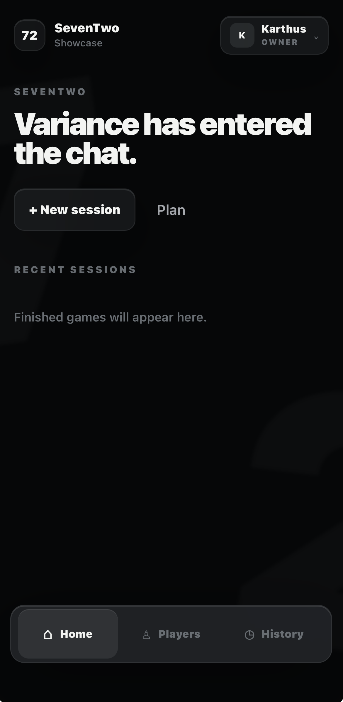
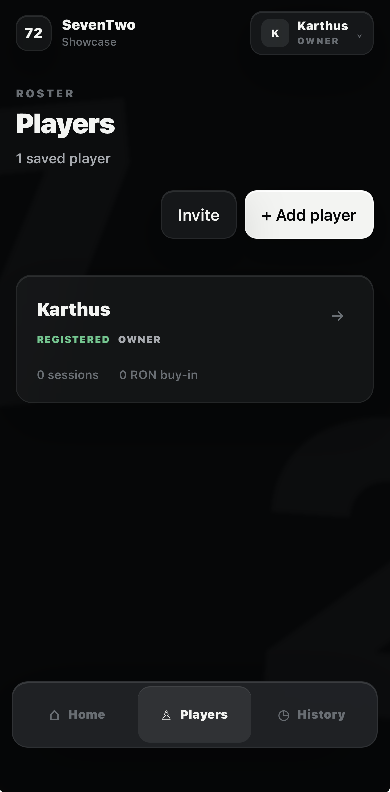

# SevenTwo

SevenTwo is a mobile-first companion for organizing live Texas Hold'em home games, from planning the night to tracking players, payments, cash-outs, and results.

[Open the live app](https://seventwo.pages.dev)

## What it does

- Organizes poker groups with shared workspaces and roles
- Plans game nights and tracks player availability
- Manages players, sessions, buy-ins, rebuys, and payments
- Handles cash-outs, settlement, history, and player statistics
- Works as an installable responsive PWA

## Showcase

| Dashboard | Players |
| --- | --- |
|  |  |

## Built with

React · TypeScript · Supabase · Tailwind CSS · Cloudflare Pages

## Status

SevenTwo is an active personal project built for real home-game use.
